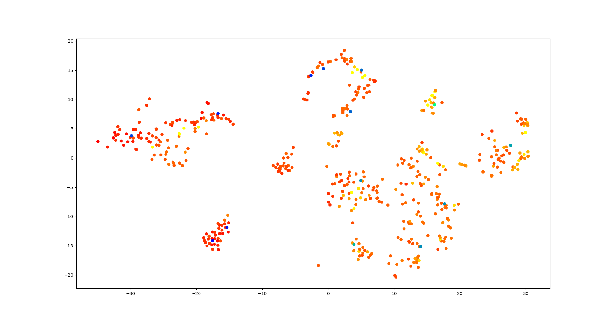
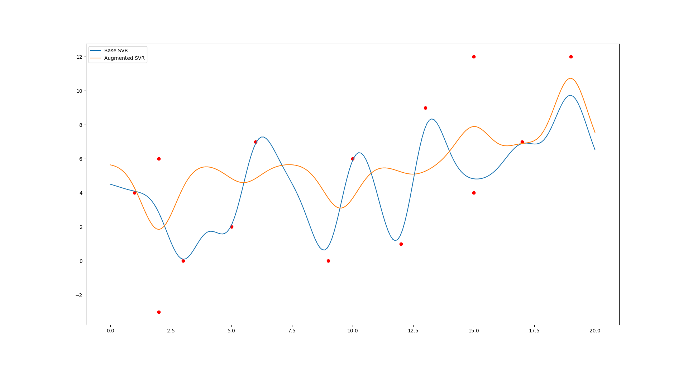
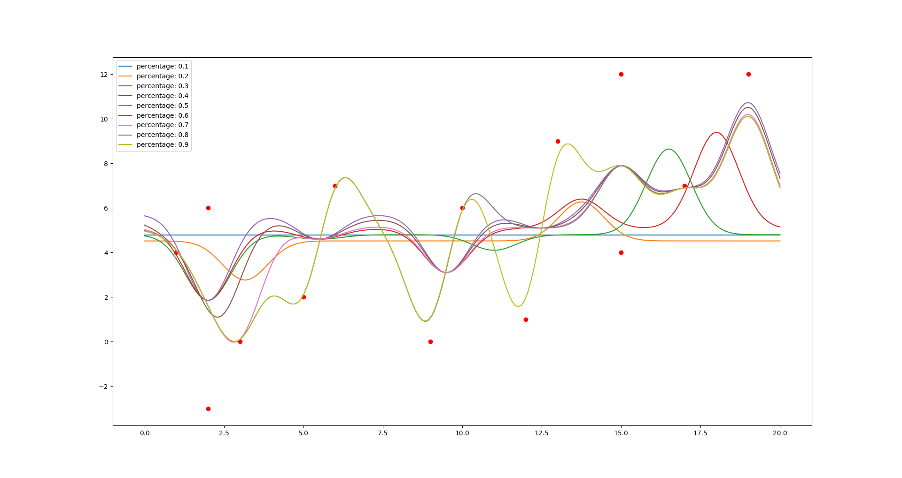

# Averaged Clusterer Augmenter

This is a data preprocessing method that typically improves the accuracy of Support Vector Machines and Kernel
Ridge Regressors, in some cases by 40% or more. The algorithm is very simple: cluster the data, find the centers of the 
clusters, then either add to or replace the original data with the centers. 

In the following graphic, the orange points are a t-SNE embedding of the boston dataset, and the blue points
are the averaged KMeans clusters.



The next image is a comparison of SVR's with identical parameters fitted to the original and augmented datasets. This
is an incredibly contrived example, but it shows how clustering and averaging the data can lead to a smoother, 
more representative fit. 



## Usage

There are two classes provided, both of which are compliant with Sklearn APIs. 

### ACAWrapper

ACAWrapper is a meta estimator responsible for clustering and averaging the data before providing it to the estimator.

```
from ACA import ACAWrapper
from sklearn.svm import SVR

regressor = SVR()
augmented_regressor = ACAWrapper(estimator=regressor)

augmented_regressor.fit(X, y)
```

### ACATransformer

ACATransformer is a transformer class for clustering and averaging the data.

```
from ACA import ACATransformer

t = ACATransformer

averaged_x, averaged_y = t.fit_transform(X, y)
```

It is not necessary to provide labels to ACATransformer.

``` 
averaged_x = t.fit_transform(X)
```

### Parameters

ACAWrapper and ACATransformer have nearly identical parameters

 - `clusterer`: the clustering algorithm to use before averaging. Defaults to KMeans, which is fastest and typically
 the most accurate.
 
 - `percentage`: A float from 0 to 1 representing a percentage. If percentage is provided, and the passed `clusterer` 
 has an `n_clusters` option, `n_clusters` will be changed to `int(len(X) * percentage)`.
 
 - `return_old`: A boolean representing whether the old data should be returned along with the new averaged centers.
 Defaults to True.
 
 - `estimator`: The base estimator to be used by ACAWrapper. Defaults to SVR()
 
 - `disabled`: A boolean value representing whether anything should be done to the data before passing it to 
 `estimator`. This is a helper option for using ACAWrapper in pipelines. ACATransformer does not have this param.
 
 The following image is a comparison of different values of `percentage`:
 
 
 
 ## Accuracy Improvements
 
 By running `run_tests.py`, a manual grid search will be performed, showing how different percentages and clusterers 
 affect the performance. A pipeline around an ACAWrapper is not used, as the clusters would have to be recomputed 
 for every SVR() instance. The test is performed on the boston and diabetes datasets.
 
 On the boston dataset, the average error of the unaugmented SVR is 86.9. The best performance achieved with augmenting
 is 50.1, a percentage increase of 42%.
 
 On the diabetes dataset, the raw error is 5949, and the best augmented error is 5796. That is a percentage
 increase of only 2.5%. 